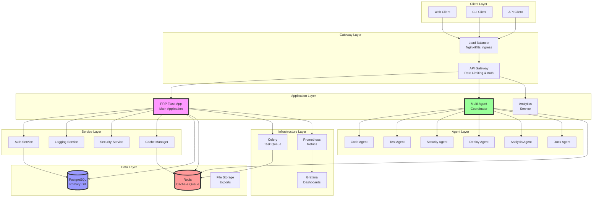
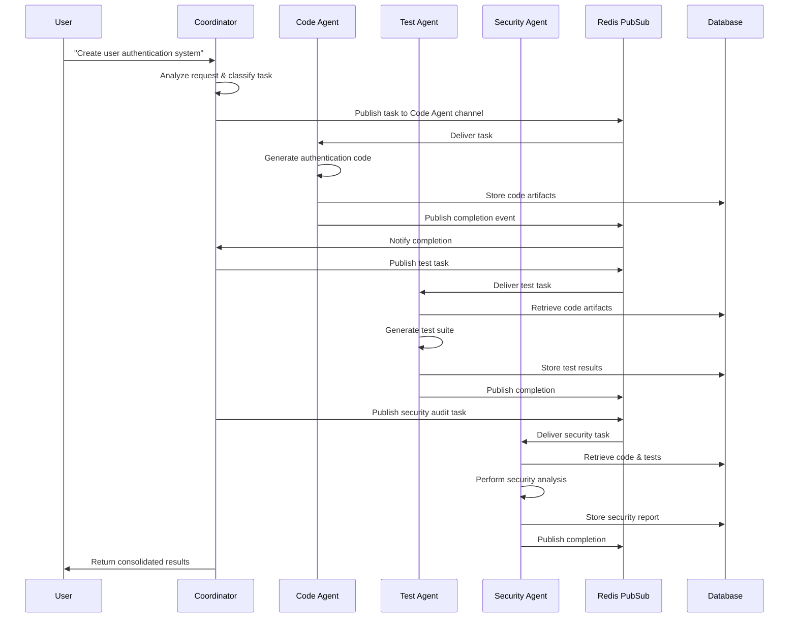
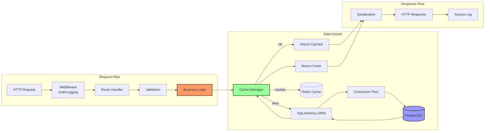
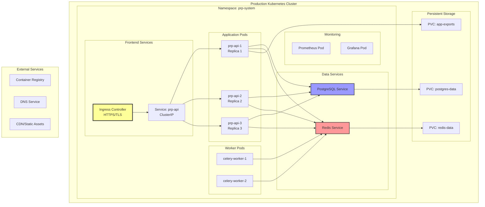
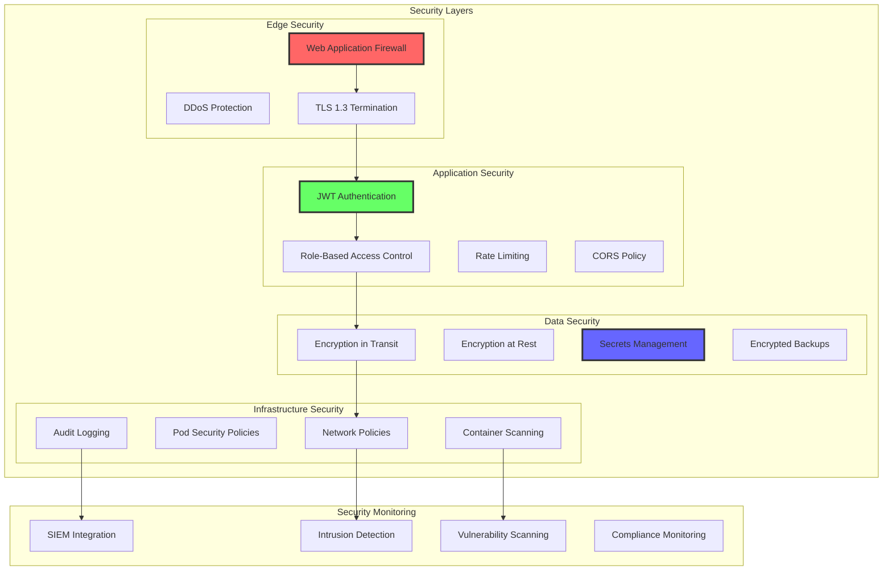
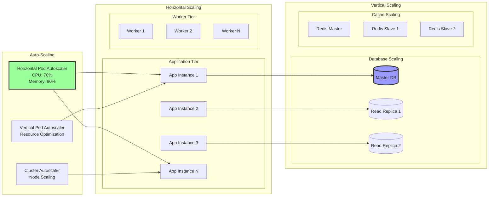
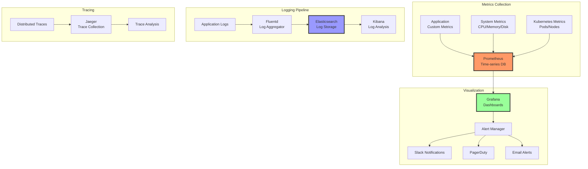
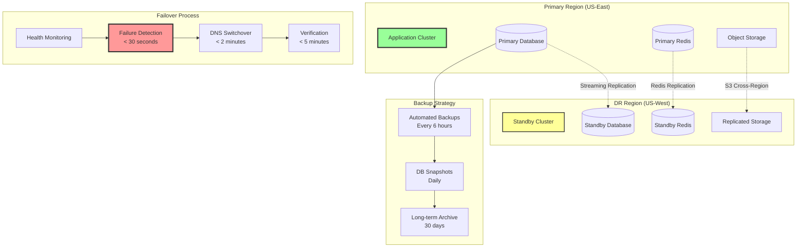

# Architecture Diagrams & Visual Documentation

## System Architecture Visualizations

### 1. Component Architecture Diagram

### 2. Multi-Agent Communication Flow

### 3. Data Flow Architecture

### 4. Deployment Architecture

### 5. Security Architecture

### 6. Scalability Strategy

### 7. CI/CD Pipeline

```mermaid
graph LR
    subgraph "Development"
        DEV[Developer] --> GIT[Git Push]
        GIT --> PR[Pull Request]
    end
    
    subgraph "CI Pipeline"
        PR --> LINT[Code Linting]
        LINT --> TEST[Unit Tests]
        TEST --> SEC[Security Scan]
        SEC --> BUILD[Docker Build]
        BUILD --> PUSH[Push to Registry]
    end
    
    subgraph "CD Pipeline"
        PUSH --> STAGE[Deploy to Staging]
        STAGE --> E2E[E2E Tests]
        E2E --> PERF[Performance Tests]
        PERF --> APPROVE[Manual Approval]
        APPROVE --> PROD[Deploy to Production]
    end
    
    subgraph "Post-Deployment"
        PROD --> SMOKE[Smoke Tests]
        SMOKE --> MONITOR[Monitoring Alerts]
        MONITOR --> ROLLBACK[Rollback if Needed]
    end
    
    style TEST fill:#9f9,stroke:#333,stroke-width:2px
    style SEC fill:#f99,stroke:#333,stroke-width:2px
    style PROD fill:#99f,stroke:#333,stroke-width:3px
```

### 8. Monitoring & Observability

### 9. Disaster Recovery Architecture

## Architecture Decision Records (ADRs)

### ADR-001: Microservices vs Modular Monolith

**Status**: Accepted  
**Date**: 2025-01-27

**Context**: Need to decide between immediate microservices architecture or starting with a modular monolith.

**Decision**: Start with a modular monolith that's microservices-ready.

**Consequences**:
- ✅ Faster initial development
- ✅ Easier debugging and deployment
- ✅ Can evolve to microservices when needed
- ❌ May face scaling challenges sooner
- ❌ Requires careful module boundary design

### ADR-002: Message Queue Selection

**Status**: Proposed  
**Date**: 2025-01-27

**Context**: Redis pub/sub is not persistent, risking message loss.

**Options**:
1. RabbitMQ - Feature-rich, complex
2. Apache Kafka - High throughput, complex
3. AWS SQS - Managed, vendor lock-in
4. Redis Streams - Persistent, familiar

**Recommendation**: Redis Streams for consistency with current stack.

### ADR-003: API Gateway Strategy

**Status**: Proposed  
**Date**: 2025-01-27

**Context**: Need advanced API management capabilities.

**Options**:
1. Kong - Open source, plugin ecosystem
2. AWS API Gateway - Managed, AWS-specific
3. Istio - Service mesh with gateway
4. Custom Nginx - Current solution

**Recommendation**: Kong for immediate needs, Istio for long-term service mesh.

---

*These diagrams provide visual representations of the system architecture, data flows, and deployment strategies. They should be updated as the architecture evolves.*