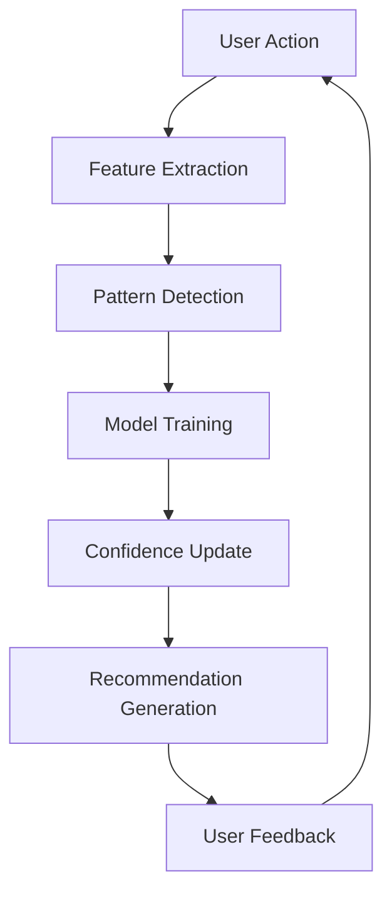

# 🤖 PRP AI Assistant - Complete Guide

## Overview

The PRP AI Assistant is a revolutionary intelligent system that learns, adapts, and provides context-aware assistance for your development workflow. It integrates seamlessly with the PRP-12Factor methodology to deliver intelligent code analysis, generation, debugging, and real-time assistance.

## 🌟 Key Features

### 1. **Contextual Code Understanding**
- **Semantic Analysis**: Understands code intent, not just syntax
- **Pattern Recognition**: Identifies architectural patterns and anti-patterns
- **Dependency Intelligence**: Maps complex dependency relationships
- **Performance Prediction**: Predicts performance impact of changes

### 2. **Adaptive Learning System**
- **Success Pattern Learning**: Learns from successful implementations
- **Failure Pattern Avoidance**: Remembers and avoids past failure modes
- **User Preference Tracking**: Adapts to your coding style and preferences
- **Continuous Improvement**: Gets better with every interaction

### 3. **Intelligent Code Generation**
- **Context-Aware Templates**: Generates code that fits your project style
- **Smart Imports**: Automatically determines correct imports and dependencies
- **Error-Resistant Code**: Generates code with built-in error handling
- **Test Generation**: Automatically creates test cases for generated code

### 4. **Real-Time Assistance**
- **Live Code Review**: Reviews code as you write it
- **Instant Problem Detection**: Catches issues before they become problems
- **Smart Suggestions**: Context-aware improvement suggestions
- **Documentation Generation**: Auto-generates documentation from code

### 5. **Advanced Debugging**
- **Root Cause Analysis**: Deep dive into complex issues
- **Solution Recommendation**: Multiple solution approaches with confidence scores
- **Impact Assessment**: Understands the full impact of changes
- **Test Scenario Generation**: Creates test cases to verify fixes

## 🚀 Getting Started

### Installation

1. **Install Dependencies**:
```bash
pip install -r requirements.txt
pip install scikit-learn joblib watchdog black autopep8
```

2. **Configure Environment**:
```bash
# .env file
AI_ENABLED=true
AI_LEARNING_ENABLED=true
AI_AUTO_SUGGEST=true
AI_CONFIDENCE_THRESHOLD=0.7
AI_MAX_SUGGESTIONS=10
```

3. **Initialize AI Components**:
```bash
python prp_app_ai.py
```

### Basic Usage

#### 1. Code Analysis
```python
# Analyze code for issues and improvements
POST /api/ai/analyze-code
{
  "code": "def process_data(data):\n    return data['value']",
  "file_path": "processor.py"
}
```

Response:
```json
{
  "overall_score": 75.0,
  "issues": [
    {
      "type": "error",
      "title": "Missing error handling",
      "description": "KeyError possible if 'value' doesn't exist",
      "line": 2,
      "priority": "high",
      "confidence": 0.85,
      "fix": "return data.get('value', None)"
    }
  ],
  "strengths": ["Concise implementation"],
  "metrics": {"lines": 2, "complexity": 1}
}
```

#### 2. Code Generation
```python
# Generate intelligent code
POST /api/ai/generate-code
{
  "request_type": "api_endpoint",
  "language": "python",
  "context": {
    "framework": "fastapi",
    "endpoint_name": "process_order",
    "method": "POST"
  },
  "requirements": {
    "required_fields": ["order_id", "items"],
    "generate_tests": true
  }
}
```

#### 3. Error Debugging
```python
# Debug errors with AI assistance
POST /api/ai/debug-error
{
  "error": "AttributeError: 'NoneType' object has no attribute 'process'",
  "context": {
    "file_path": "handler.py",
    "line_number": 45,
    "locals": {"processor": null}
  }
}
```

#### 4. Get AI Recommendations
```python
# Get context-aware recommendations
GET /api/ai/get-recommendations?factor=dependencies
```

## 🧠 How It Works

### Learning Pipeline



### Architecture

```
┌─────────────────────────────────────────────────────────┐
│                   PRP AI Assistant                       │
├─────────────────────────────────────────────────────────┤
│  ┌─────────────┐  ┌─────────────┐  ┌─────────────┐    │
│  │  Learning   │  │  Adaptive   │  │    Code     │    │
│  │   Engine    │  │   System    │  │  Generator  │    │
│  └──────┬──────┘  └──────┬──────┘  └──────┬──────┘    │
│         │                 │                 │           │
│  ┌──────┴─────────────────┴─────────────────┴──────┐   │
│  │          Core AI Processing Engine               │   │
│  └──────────────────────┬──────────────────────────┘   │
│                         │                               │
│  ┌─────────────┐  ┌────┴──────┐  ┌─────────────┐     │
│  │  Real-time  │  │  Advanced │  │   Pattern   │     │
│  │  Assistant  │  │  Debugger │  │ Recognition │     │
│  └─────────────┘  └───────────┘  └─────────────┘     │
└─────────────────────────────────────────────────────────┘
```

## 📊 AI Learning Metrics

### Track Learning Progress
```python
GET /api/ai/learning-progress
```

Response shows:
- Total actions learned from
- Patterns discovered
- Model accuracy
- Recommendation effectiveness
- User preference alignment

## 🔧 Advanced Configuration

### Fine-tuning AI Behavior

```python
# PRPs/config/ai-config.json
{
  "learning": {
    "min_confidence": 0.6,
    "pattern_threshold": 0.8,
    "max_history": 10000,
    "retrain_interval_hours": 24
  },
  "generation": {
    "style_adaptation": true,
    "import_optimization": true,
    "test_generation": true,
    "documentation": true
  },
  "debugging": {
    "max_stack_depth": 20,
    "code_context_lines": 5,
    "solution_confidence_threshold": 0.7
  },
  "realtime": {
    "auto_suggest_delay": 0.5,
    "max_suggestions": 10,
    "file_watch_patterns": ["*.py", "*.js", "*.ts"]
  }
}
```

### Custom Training

```python
# Train on your specific patterns
from PRPs.scripts.prp_ai_learning_engine import AILearningEngine

engine = AILearningEngine()

# Record custom patterns
engine.record_user_action(UserAction(
    action_type="custom_pattern",
    factor="your_domain",
    context={"pattern": "your_pattern"},
    timestamp=datetime.now()
))
```

## 🎯 Use Cases

### 1. **Automated Code Review**
- Instant feedback on code quality
- Security vulnerability detection
- Performance bottleneck identification
- Best practice enforcement

### 2. **Intelligent Refactoring**
- Suggests optimal refactoring strategies
- Predicts impact of changes
- Generates refactored code automatically
- Maintains code style consistency

### 3. **Error Prevention**
- Predicts potential errors before they occur
- Suggests defensive coding patterns
- Generates comprehensive error handling
- Creates test cases for edge scenarios

### 4. **Learning Acceleration**
- Learns from team's best practices
- Propagates knowledge across projects
- Suggests proven solutions
- Documents patterns automatically

## 🛡️ Security & Privacy

### Data Handling
- All learning data is stored locally
- No code is sent to external services
- User-specific patterns are isolated
- Sensitive information is automatically excluded

### Compliance
- GDPR compliant data handling
- Configurable data retention
- Audit trail for all AI decisions
- Explainable AI recommendations

## 📈 Performance Impact

### Resource Usage
- **Memory**: ~200MB for AI models
- **CPU**: Minimal impact (< 5% during analysis)
- **Storage**: ~50MB for learning data
- **Network**: No external API calls

### Optimization Tips
1. Configure confidence thresholds based on needs
2. Limit real-time monitoring to active files
3. Schedule model retraining during off-hours
4. Use caching for repeated analyses

## 🤝 Integration Examples

### VS Code Extension
```javascript
// Example VS Code integration
const prpAI = vscode.extensions.getExtension('prp-ai-assistant');

// Get real-time suggestions
prpAI.activate().then(api => {
    api.onDidChangeSuggestions(suggestions => {
        // Display suggestions in VS Code
    });
});
```

### CI/CD Pipeline
```yaml
# GitHub Actions example
- name: AI Code Analysis
  run: |
    curl -X POST http://localhost:8000/api/ai/analyze-code \
      -H "Content-Type: application/json" \
      -d '{"code": "${{ github.event.pull_request.diff }}"}'
```

### Git Hooks
```bash
#!/bin/bash
# .git/hooks/pre-commit
# AI-powered pre-commit analysis

FILES=$(git diff --cached --name-only --diff-filter=ACM | grep -E '\.(py|js|ts)$')

for FILE in $FILES; do
    CONTENT=$(cat "$FILE")
    RESULT=$(curl -s -X POST http://localhost:8000/api/ai/analyze-code \
        -H "Content-Type: application/json" \
        -d "{\"code\": \"$CONTENT\", \"file_path\": \"$FILE\"}")
    
    SCORE=$(echo $RESULT | jq -r '.overall_score')
    if (( $(echo "$SCORE < 70" | bc -l) )); then
        echo "❌ AI Analysis: $FILE scored $SCORE/100"
        echo "Issues found:"
        echo $RESULT | jq -r '.issues[] | "  - \(.title)"'
        exit 1
    fi
done
```

## 🚨 Troubleshooting

### Common Issues

1. **AI not providing suggestions**
   - Check AI_ENABLED=true in environment
   - Verify AI components initialized in health check
   - Check confidence threshold settings

2. **Learning not improving**
   - Ensure AI_LEARNING_ENABLED=true
   - Check if sufficient data collected (min 50 actions)
   - Verify model retraining is occurring

3. **Slow performance**
   - Reduce AI_MAX_SUGGESTIONS
   - Increase AI_CONFIDENCE_THRESHOLD
   - Disable real-time monitoring for large files

## 🎓 Best Practices

1. **Provide Feedback**: Rate AI suggestions to improve accuracy
2. **Regular Training**: Let AI learn from your patterns over time
3. **Context Matters**: Provide rich context for better suggestions
4. **Trust but Verify**: AI suggestions should be reviewed
5. **Continuous Learning**: AI improves with usage

## 📚 API Reference

### Endpoints

| Endpoint | Method | Description |
|----------|--------|-------------|
| `/api/ai/analyze-code` | POST | Analyze code for issues and improvements |
| `/api/ai/generate-code` | POST | Generate intelligent code |
| `/api/ai/debug-error` | POST | Debug errors with AI assistance |
| `/api/ai/get-recommendations` | GET | Get context-aware recommendations |
| `/api/ai/provide-feedback` | POST | Provide feedback on recommendations |
| `/api/ai/learning-progress` | GET | Get learning statistics |
| `/api/ai/config` | GET | Get current AI configuration |

## 🔮 Future Enhancements

- **Multi-language Support**: Expanding beyond Python/JavaScript
- **Team Learning**: Shared learning across team members
- **Visual Debugging**: AI-powered visual debugging tools
- **Natural Language**: Code generation from natural language
- **Performance Optimization**: AI-driven performance tuning

---

## 📞 Support

For issues or questions:
- Check the logs: `tail -f logs/ai-assistant.log`
- Run diagnostics: `python -m PRPs.scripts.ai_diagnostics`
- Review health check: `GET /health`

Remember: The AI Assistant learns and improves continuously. The more you use it, the better it becomes at understanding your specific needs and patterns!